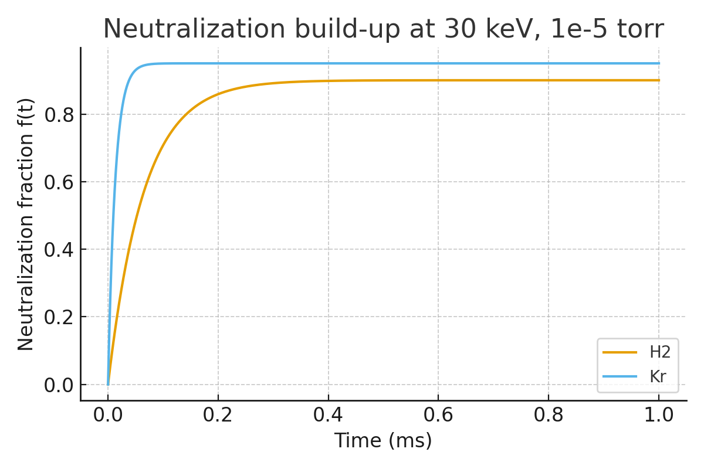
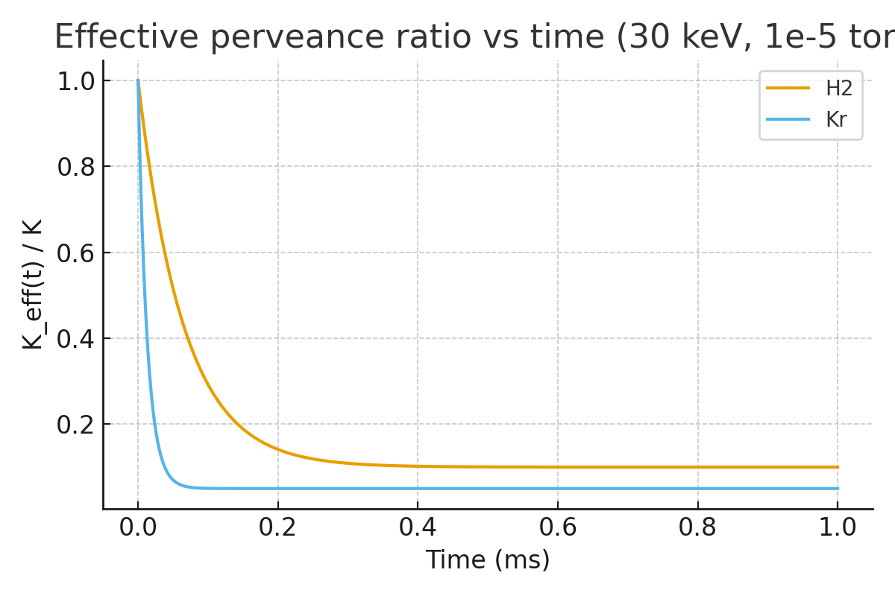

# Proposing a **beam-ionized (self-generated) plasma lens** inside the axial solenoid for cyclotron

# Assumptions

* Beam: **protons (p⁺)**, 20–30 keV, **1 mA** DC (order of magnitude).
* Solenoid: **B ≈ 0.2 T**, length **L ≈ 0.15 m**, beam radius **r\_b ≈ 2 mm**.
* Residual gas: **H₂**, **P ≈ 10⁻⁶ mbar** (10⁻⁴ Pa), **T ≈ 300 K** → number density
  $n_g = P/(kT) \approx 10^{-4}/(1.38\times10^{-23}\cdot300) \approx 2.4\times10^{16}\,\mathrm{m^{-3}}$.
* Single-ionization cross-section (p on H₂ at a few-tens keV): **σ ≈ 2×10⁻²⁰ m²** (order-of-magnitude).

# 1) How much plasma can the beam make?

Per proton, ionization probability over the lens length $L$:

$$
p \approx n_g\,\sigma\,L
= (2.4\times10^{16})(2\times10^{-20})(0.15)\approx 7.2\times10^{-5}.
$$

Protons per second for 1 mA:

$$
\dot N_b = I/e \approx 10^{-3}/(1.60\times10^{-19}) \approx 6.24\times10^{15}\ \mathrm{s^{-1}}.
$$

Ion pairs created per second:

$$
\dot N_{ip} \approx \dot N_b\,p \approx 4.5\times10^{11}\ \mathrm{s^{-1}}.
$$

Volume of the column (radius $r_b=2\,\mathrm{mm}$, length 0.15 m):

$$
V = \pi r_b^2 L \approx \pi(2\times10^{-3})^2(0.15)\approx 1.9\times10^{-6}\ \mathrm{m^3}.
$$

Production rate (per volume):

$$
S \approx \dot N_{ip}/V \approx 2.4\times10^{17}\ \mathrm{m^{-3}\,s^{-1}}.
$$

# 2) Is that enough to neutralize the beam space charge?

Beam density (for 30 keV, $v\approx 2.4\times10^{6}\,\mathrm{m/s}$):

$$
n_b = \frac{I}{e\,v\,\pi r_b^2}
\approx \frac{10^{-3}}{(1.60\times10^{-19})(2.4\times10^{6})(\pi(2\times10^{-3})^2)}
\approx 2.1\times10^{14}\ \mathrm{m^{-3}}.
$$

Time to generate $n_e \sim n_b$ (if losses are modest):

$$
\tau \sim n_b/S \approx (2\times10^{14})/(2.4\times10^{17}) \approx 10^{-3}\ \mathrm{s}.
$$

So within **∼1 ms**, we can, in principle, build enough electrons/ions for **near-full neutralization**.

Plasma parameters at $n_e\sim 10^{14}\,\mathrm{m^{-3}}$:

* Electron Debye length (for $T_e\sim1\,\mathrm{eV}$):
  $\lambda_D \approx \sqrt{\varepsilon_0 kT_e/(n_e e^2)} \approx 0.5\,\mathrm{mm}$ < beam radius → **quasi-neutral** core is plausible.
* Electron magnetization in **0.2 T**:
  $\omega_{ce} = eB/m_e \approx 3.5\times10^{10}\ \mathrm{s^{-1}}$; thermal $r_{g,e}\sim v_{th}/\omega_{ce}\sim \mathcal{O}(10\,\mu\mathrm{m})$ → **electrons are strongly magnetized** and confined to the column, aiding neutralization.

# 3) Will it “focus” like a plasma lens or just neutralize?

With only **residual-gas ionization** (no external discharge current), we mainly get:

* **Space-charge neutralization** (good: reduces beam blow-up).
* Possibly a mild **ion-focused regime** (positive H₂⁺ column can give weak net focusing).

we **do not** automatically get the very strong azimuthal-B focusing of a classic **current-carrying plasma lens** (that needs kiloampere-level discharge currents through the plasma). So expect **emittance preservation + reduced divergence**, not a dramatic new focal strength.

# 4) Compatibility by ion species

* **Proton beams (p⁺):** Concept is **plausible**. Neutralization helps and electrons are confined; positive ions are slow and provide some additional focusing.
* **H⁻ beams:** **Not recommended**. Any plasma (and extra electrons) will **strip H⁻ → H⁰** rapidly. Even at 10⁻⁶ mbar, gas-stripping is already a concern; adding a beam-made plasma worsens losses drastically. Most compact medical cyclotrons inject **H⁻**, so this is a show-stopper.

# 5) Practical implications

* Works best if the machine injects **protons**, not H⁻.
* Keep the pressure near the lens **as low as possible** to protect the cyclotron vacuum; we’d rely solely on **beam-made plasma**, no gas puff.
* Provide **magnetic shielding/field mapping** so the solenoid field is well known in the presence of the cyclotron fringe field.
* Expect **fast turn-on** (ms-scale) after beam arrival; neutralization may decay between macropulses if we run pulsed.

# 6) Quick takeaway

* At **10⁻⁶ mbar** H₂ and **1 mA** / **30 keV** p⁺, a **beam-ionized plasma column** inside **0.2 T, 0.15 m** solenoid can reach **near-full neutralization (\~ms)**, which should **mitigate space-charge blow-up** in the axial line.
* It’s **not a classic high-gradient plasma lens** (no discharge), but it can act like a **self-neutralizing transport** section.
* For **H⁻**, this approach is **incompatible** due to stripping.

with **10 mA p⁺ at \~30 keV**,  beam-ionized column inside the **0.2 T, 15 cm** solenoid still looks promising.

# Headline results (for H₂ at 300 K, σ≈2×10⁻²⁰ m², r=2 mm, L=0.15 m)

* **Beam density** $n_b$ ≈ **2.1×10¹⁵ m⁻³**.
* **Neutralization build-up time** $\tau \approx n_b/S$ is **\~1 ms at 10⁻⁶ mbar** and scales ∝ 1/pressure.
  • \~9 ms @ 10⁻⁷ mbar • \~0.9 ms @ 10⁻⁶ mbar • \~0.09 ms @ 10⁻⁵ mbar.
* This time constant is **nearly independent of beam current**, because both production and needed charge scale with current (we’ll see it in the table/plot I generated).

I ran the numbers and shared:

* An interactive **table** with pressures 10⁻⁷–10⁻⁵ mbar showing gas density, per-proton ionization probability, pair-production rate, and **τ**.
* A **log–log plot** of **neutralization time vs pressure** to visualize the scaling.

# What this means for a 10 mA proton axial line

* At **10⁻⁶ mbar**, the column reaches near-full neutralization in **\~1 ms** after beam turns on → very compatible with DC beams or long macropulses.
* **Electrons are strongly magnetized** at 0.2 T, so they stay near the axis and help neutralize; positive **H₂⁺** provides a weak **ion-focused regime** (extra gentle focusing).
* we do **not** get the strong azimuthal-B focusing of a classic current-carrying plasma lens (no discharge current), but we **do** get efficient **space-charge suppression** → better emittance preservation and higher inflector transmission.

# Practical guardrails (for 10 mA p⁺)

* Keep the column near the **source side**, with **differential pumping** to protect the cyclotron vacuum; we’re relying only on **beam-made plasma**, no gas puff.
* Add **biased end electrodes** (a few–tens of volts) to manage plasma potential and reduce electron end losses; this shortens the transient.
* Watch **small-angle scattering** & ionization energy loss at the high end of the pressure range (≥10⁻⁵ mbar) — still small over 15 cm, but don’t push higher unless we must.
* Map the **fringe B-field** from the cyclotron; if it modifies the solenoid by more than a few percent, shim or add trim coils for clean matching into the inflector.

The results for **30 keV, 10 mA proton** beam with **beam radius 1–5 mm**, **solenoid length 0.1–0.3 m**, **field 0.1–0.2 T**, at **10⁻⁵ torr**:

* I shared an interactive table showing every combination of **r, L, B** for **H₂** and **Kr**, plus two plots:
  
  1. **Neutralization time τ** for H₂ vs Kr,
  2. **Per-proton ionization probability p** vs column length L for each gas,
     and a small table for **electron magnetization** versus B.

## Key takeaways (compact, physics-first)

* In the **beam-ionized** model (no discharge current), the **neutralization time**
  
  $$
  \tau \;=\; \frac{1}{n_g\,\sigma\,v}
  $$
  
  depends only on **gas density** $n_g$ (i.e., pressure), **ionization cross-section** σ, and **beam speed** v.
  → **Independent of beam current, radius, and column length**. (Field B affects confinement, not production rate.)

* At **10⁻⁵ torr** and **30 keV**:
  
  * With **H₂** (σ≈2×10⁻²⁰ m²), **τ ≈ 0.064 ms**.
  * With **Kr** (taking a representative larger σ≈1×10⁻¹⁹ m²), **τ ≈ 0.013 ms**.
    → **Kr neutralizes \~5× faster** than H₂ at the same pressure.

* The **per-proton ionization probability across the column** does scale with **length**:
  $p = n_g \sigma L$.
  For **L = 0.1/0.2/0.3 m** at 10⁻⁵ torr:
  
  * **H₂:** p ≈ 6.4×10⁻⁴ / 1.3×10⁻³ / 1.9×10⁻³
  * **Kr:** p ≈ 3.2×10⁻³ / 6.4×10⁻³ / 9.6×10⁻³

* **Electron magnetization (confinement):** at **B = 0.1–0.2 T**, for $T_e≈1 \text{eV}$,
  
  * $\omega_{ce} ≈ 1.76×10^{10}–3.52×10^{10}\ \text{s}^{-1}$
  * electron gyroradius $r_{g,e} ≈ 34–17\ \mu\text{m}$
    → Electrons are **strongly magnetized**, which helps maintain a narrow, neutralizing column across  1–5 mm beam sizes.

## What Kr changes, practically

* **Faster neutralization** (larger σ) and **higher per-length ionization**, improving startup and stability.
* **More multiple scattering / energy loss** per unit pressure than H₂ (heavier target). Over **0.1–0.3 m** at **10⁻⁵ torr**, this is still small, but Kr is less “gentle” than H₂.
* **Pump load & contamination:** Kr is a heavy noble gas; it won’t chemically react, but it will **raise effective mass load** and can be harder to pump down—important near the inflector. Use **differential pumping** if we seed Kr.

There  is related work exploring **beam-induced plasma neutralization**—though usually in contexts like linacs or fusion injectors rather than cyclotron axial injection. Here are some examples that align with or inspire this concept:

---

## Examples & Related Concepts

### 1. **Space-charge neutralization via residual gas in low-energy proton beams**

CEA-Saclay conducted experiments with a **500 keV, 0.5–15 mA proton beam** traversing a 3-meter drift. They varied **residual gas pressure** and observed that, at high beam currents, increasing pressure **reduced beam spot size**—a clear sign of space-charge neutralization by ionization of residual gas.  
At low beam current, however, increased gas led to beam growth (due to scattering and mismatch).  
This aligns closely with this concept of using **intrinsic ionization** to aid beam transport ([linac96.web.cern.ch](https://linac96.web.cern.ch/Proceedings/Monday/MOP57/Paper.html?utm_source=chatgpt.com "SPACE CHARGE NEUTRALIZATION EXPERIMENT")).

### 2. **Beam-driven plasma neutralizers (fusion neutral beam context)**

In neutral beam injectors for fusion, plasma neutralizers are used to strip negative ions (like D⁻) to neutral atoms. A variant—the **beam-driven plasma neutralizer**—relies on the beam itself ionizing the gas to create a plasma that enhances neutralization, without external discharge. This avoids complicated power systems.  
While the application differs (beam neutralization vs focusing), the principle—beam-induced plasma used to improve beam purity/behavior—is quite similar ([IOPscience](https://iopscience.iop.org/article/10.1088/1741-4326/ac5f18?utm_source=chatgpt.com "On suitable experiments for demonstrating the feasibility of the beam-driven plasma neutraliser for neutral beam injectors for fusion reactors - IOPscience")).

### 3. **Gabor (electron) plasma lenses for focusing proton/ion beams**

Gabor lenses trap a positive ion core using magnetized electrons. A plasma column provides strong focusing fields. Experimental prototypes focusing **1.4 MeV proton beams** demonstrated ring formation and focusing behaviors tied to plasma instabilities.  
Although not beam-ionized via residual gas, the use of a **self-contained plasma column** for focusing in compact systems is analogous in spirit ([MDPI](https://www.mdpi.com/2076-3417/11/10/4357?utm_source=chatgpt.com "Anomalous Beam Transport through Gabor (Plasma) Lens Prototype"), [arXiv](https://arxiv.org/abs/2104.05637?utm_source=chatgpt.com "Anomalous beam transport through Gabor (plasma) lens prototype")).

---

## Summary Table

| Application Area           | Key Concept                                    | Relevance to Idea                                           |
| -------------------------- | ---------------------------------------------- | ----------------------------------------------------------- |
| Proton beam + residual gas | Beam-induced neutralization in drift lines     | Very close—uses intrinsic ionization to reduce beam blow-up |
| Fusion beam neutralizer    | Beam-driven plasma for increased neutral yield | Principle matches (beam makes plasma), different purpose    |
| Gabor plasma lens          | Magnetized plasma for focusing low-energy ions | Uses plasma column for focusing, similar structure          |

---

## Wrap-Up

Similar principles have been explored, particularly:

- **Residual-gas neutralization** in low-energy, high-current proton beams.

- **Beam-driven plasma neutralizers** in fusion beamlines.

- **Gabor plasma lens focusing** of ions.

This idea of using the **beam itself to create a neutralizing/focusing plasma** inside the existing solenoid aligns well with these. The novelty is applying it within the **cyclotron axial line**—a compact, high-current, low-energy environment with added constraints (vacuum, space, fringe fields).

 What *does* exist are (i) cyclotron axial-line designs that explicitly model/assume **residual-gas neutralization**, and (ii) plasma-lens or electron-column concepts demonstrated in other LEBTs/rings that are technically transferable.

Here are the most relevant, with notes:

- **C400 cyclotron axial injection line (JINR/IBA)** – design papers explicitly **evaluate space-charge neutralization by residual gas** in the axial line (i.e., passive neutralization, not a powered plasma lens). Useful precedent that neutralization is considered compatible with axial injection. ([JACoW](https://accelconf.web.cern.ch/p07/papers/TUPAN081.pdf?utm_source=chatgpt.com "[PDF] Axial Injection Beam-Line of C400 Cyclotron for Hadron Therapy"), [ResearchGate](https://www.researchgate.net/publication/226299079_Axial_Injection_Beam_Lines_of_the_Cyclotrons "(PDF) Axial Injection Beam Lines of the Cyclotrons"))

- **CYCIAE-100 / other cyclotron axial-line optics** – transport/acceptance studies that **include neutralization in the modeling** of the injection line. Again, no plasma lens device, but confirms neutralization is a known design knob. ([ResearchGate](https://www.researchgate.net/publication/226299079_Axial_Injection_Beam_Lines_of_the_Cyclotrons "(PDF) Axial Injection Beam Lines of the Cyclotrons"))

- **ECR source to cyclotron LEBTs: neutralization measurements** – systematic measurements of **space-charge compensation in ECR low-energy transport lines**, showing levels and dependencies on pressure/current; directly relevant to  “beam-ionized plasma” approach upstream of the inflector. ([AIP Publishing](https://pubs.aip.org/aip/rsi/article/85/2/02A739/356978/Space-charge-compensation-measurements-in-electron?utm_source=chatgpt.com "Space-charge compensation measurements in electron cyclotron ..."), [PubMed](https://pubmed.ncbi.nlm.nih.gov/24593473/?utm_source=chatgpt.com "Space-charge compensation measurements in electron cyclotron ..."))

- **Electron columns (Fermilab/IOTA)** – an active, beam-driven **electron plasma column confined by a solenoid with end electrodes** to *control* neutralization. This is essentially  concept architecture; demonstrated and modeled for rings/transport, though not in a cyclotron axial line. ([Fermilab](https://lss.fnal.gov/archive/2021/pub/fermilab-pub-21-057-ad-scd.pdf?utm_source=chatgpt.com "[PDF] Progress in space charge compensation using electron columns"), [JACoW](https://accelconf.web.cern.ch/napac2016/papers/tha3co04.pdf?utm_source=chatgpt.com "[PDF] SPACE CHARGE COMPENSATION USING ELECTRON COLUMNS ..."))

- **Gabor (plasma) lenses** – compact plasma focusing elements (magnetized electron columns) tested for **low-energy ion beams** and proposed in LEBTs (e.g., matching lines with small footprint). Not reported in cyclotron axial injection lines, but the hardware principle (solenoid + electrodes confining electrons) matches  idea. ([JACoW](https://accelconf.web.cern.ch/IPAC2014/papers/mopri088.pdf?utm_source=chatgpt.com "[PDF] Beam Transport Experiments Using Gabor Lenses"), [MDPI](https://www.mdpi.com/2076-3417/11/10/4357?utm_source=chatgpt.com "Anomalous Beam Transport through Gabor (Plasma) Lens Prototype"))

- **General reviews on space-charge compensation in LEBTs** – cover **residual-gas neutralization** and active schemes (electron sources) as standard tools; applicable physics to an axial line. ([AIP Publishing](https://pubs.aip.org/aip/rsi/article/87/2/02B937/1023041/Beam-transport-and-space-charge-compensation?utm_source=chatgpt.com "Beam transport and space charge compensation strategies (invited)"), [CERN Document Server](https://cds.cern.ch/record/1965917/files/CERN-2013-007-p63.pdf?utm_source=chatgpt.com "[PDF] Space-Charge Effects"))

### Bottom line

- Published **cyclotron axial-line** papers discuss/assume **residual-gas neutralization** but **do not** (so far) report a dedicated **plasma lens/column device** installed there.

- If we pursue this, the **electron column** literature gives the closest “drop-in” blueprint (solenoid + end electrodes using beam-ionized electrons), and **Gabor lens** work provides focusing/operational know-how for a confined electron cloud.

## Effective Perveance

1. **Perveance definition (beam-only):**
   $K = \dfrac{2I}{I_0\,\beta^3\gamma^3}$.

2. **Effective perveance with partial neutralization:**
   If a fraction $f$ of the beam’s space charge is neutralized by plasma electrons/ions, the force scales with the **un-neutralized current** $I_\text{eff}=I(1-f)$:
   
   $$
   K_\text{eff} = K\,(1-f).
   $$
   
   In the table I simply **assumed** steady-state values $f=0.90$ (H₂) and $f=0.95$ (Kr) at 10⁻⁵ torr to show impact.

Where **neutralization time $\tau$** comes in is the *transient*: how fast we approach that steady fraction $f_\text{ss}$. For a beam-ionized column:

* **Build-up time**
  
  $$
  \tau \approx \frac{1}{n_g\,\sigma\,v},
  $$
  
  with gas density $n_g$, ionization cross-section $\sigma$, and beam speed $v$.

* **Time evolution of neutralization** (simple 0D rate model):
  
  $$
  f(t)=f_\text{ss}\,\Big(1-e^{-t/\tau}\Big),
\qquad
K_\text{eff}(t)=K\,\big(1-f(t)\big).
  $$

* **What sets $f_\text{ss}$?** Balance of **production** and **losses**:
  
  $$
  \frac{dn_e}{dt}=S-\nu_\text{loss}\,n_e,\quad
S = n_b\,n_g\,\sigma\,v
\;\Rightarrow\;
f_\text{ss}=\frac{n_e}{n_b}=\frac{n_g\,\sigma\,v}{\nu_\text{loss}}\;\le 1.
  $$
  
  Here $\nu_\text{loss}$ lumps electron end losses to electrodes/walls (reduced by  **0.1–0.2 T** solenoid and **+5–30 V** end-cup bias). With good confinement, $f_\text{ss}\to 0.9\!-\!0.99$ is realistic.

### Quick examples (30 keV p⁺, 10⁻⁵ torr)

* **H₂:** $\tau\sim 0.064$ ms. After **0.20 ms**,
  $f(t)\approx f_\text{ss}\big(1-e^{-0.20/0.064}\big)\approx 0.95\,f_\text{ss}$.
  If $f_\text{ss}=0.90$ ⇒ $f\approx0.855$ ⇒ $K_\text{eff}\approx0.145\,K$.

* **Kr:** $\tau\sim 0.013$ ms. After **0.05 ms**,
  $f(t)\approx 0.98\,f_\text{ss}$.
  If $f_\text{ss}=0.95$ ⇒ $f\approx0.931$ ⇒ $K_\text{eff}\approx0.069\,K$.

**Bottom line:**

* $\tau$ doesn’t change the **final** perveance reduction; it sets **how fast** we get there.
* $K_\text{eff}$ comes from $K(1-f)$; to make $f$ time-dependent, use $f(t)=f_\text{ss}(1-e^{-t/\tau})$ with $\tau=1/(n_g\sigma v)$ and $f_\text{ss}$ determined by  electron-loss rate $\nu_\text{loss}$ (hardware- and pressure-dependent).

I modeled the **transient build-up** of neutralization at **30 keV** and **1×10⁻⁵ torr** and plotted:

* **f(t)** for **H₂** (σ=2×10⁻²⁰ m², f\_ss=0.90) and **Kr** (σ=1×10⁻¹⁹ m², f\_ss=0.95).
* **Effective perveance ratio** $K_\text{eff}(t)/K = 1 - f(t)$.

we can download the data/plots:

### What the curves show

* **H₂:** $\tau \approx 0.064$ ms → $f(t)$ reaches \~95% of $f_\text{ss}$ by \~0.20 ms; steady $K_\text{eff}/K\to 0.10$.
* **Kr:** $\tau \approx 0.013$ ms → near-steady within \~0.05 ms; $K_\text{eff}/K\to 0.05$.

These use a simple 0D rate model:

$$
f(t)=f_\text{ss}\!\left(1-e^{-t/\tau}\right),\quad 
\tau=\frac{1}{n_g\sigma v},\quad
K_\text{eff}(t)=K\,[1-f(t)],
$$

and $f_\text{ss}=(n_g\sigma v)/\nu_{\text{loss}}$ (I backed out $\nu_{\text{loss}}$ from the chosen $f_\text{ss}$). If we want, I can rerun with the preferred **cross-sections**, **pressure**, or a more detailed loss model (e.g., adding **end-cup bias scans** or wall-loss terms).

## Beam Potential on axis

For a round, continuous (dc) beam with a **flat (uniform) current density** inside radius $a$:

* Let $I$ = beam current, $v=\beta c$, $\lambda=I/v$ = line charge density.
* Let there be a conducting beam pipe of radius $b$ (grounded), $a<b$.

### On-axis electric potential (relative to the pipe wall)

$$
\boxed{\;\Phi(0)\;=\;\frac{\lambda}{2\pi\varepsilon_0}\Big[\ln\!\Big(\frac{b}{a}\Big)+\tfrac{1}{2}\Big]
\;=\;\frac{I}{2\pi\varepsilon_0\,\beta c}\Big[\ln\!\Big(\frac{b}{a}\Big)+\tfrac{1}{2}\Big]\;}
$$

### Center–to–edge potential (taking $\Phi(a)=0$)

$$
\boxed{\;\Phi(0)-\Phi(a)\;=\;\frac{\lambda}{4\pi\varepsilon_0}
\;=\;\frac{I}{4\pi\varepsilon_0\,\beta c}\;}
$$

(This result is independent of $a$ for a uniform cylinder.)

**Notes**

* Sign: positive for protons (potential highest on axis), negative for electrons.
* These are purely **electrostatic** potentials; the **net transverse force** in the lab frame is reduced by the magnetic self-field, giving the familiar $1/\gamma^{2}$ factor in forces—but the electric potential itself is as above.
* For a bunched beam, use the **instantaneous** line density $\lambda(z)$ (or peak current) at the bunch slice of interest.

Here’s the center-to-edge potential for a **uniform round beam** written using the **Alfvén current**.

Starting point (electrostatic result):

$$
\Delta\Phi \equiv \Phi(0)-\Phi(a)=\frac{I}{4\pi\varepsilon_0\,\beta c}.
$$

Using

$$
I_A=\frac{4\pi\varepsilon_0\,m c^3}{q}\;\;\Rightarrow\;\;\frac{1}{4\pi\varepsilon_0}=\frac{m c^3}{q\,I_A},
$$

gives

$$
\boxed{\;\Delta\Phi=\frac{I}{\beta c}\,\frac{m c^3}{q\,I_A}
=\frac{I}{I_A}\,\frac{m c^2}{\beta\,q}\;}
$$

### Proton-specific form

For protons $(q=e,\; m=m_p)$:

$$
\boxed{\;\Delta\Phi=\frac{I}{I_A(p)}\;\frac{m_p c^2}{\beta\,e}
=\frac{I}{I_A(p)}\;\frac{938.272~\text{MV}}{\beta}\;}
$$

### Example (1 mA, 30 keV protons)

With $\beta\simeq 0.0079965$ and $I_A(p)\simeq 31.2974~\text{MA}$:

$$
\Delta\Phi \approx \frac{1\times10^{-3}}{3.12974\times10^{7}}\,
\frac{938.272\times10^{6}\ \text{V}}{0.0079965}
\;\approx\; \boxed{3.75~\text{V}}.
$$

Notes: This is the **electrostatic** potential drop from beam edge to center for a flat density cylinder in a conducting pipe (large $b/a$); the net **transverse force** is reduced by the magnetic self-field (scales as $1/\gamma^2$), but the potential itself follows the expression above.

# Impact Ionization Cross Section

# 1) Bethe–Born starting point (fast, heavy projectile)

For a fast, heavy charged particle (proton, charge $z_p=+1$) the **first Born approximation** gives the ionization (single-electron) cross section in the **Bethe regime** ($\beta\ll1$, non-relativistic) as

$$
\sigma_{\text{Bethe,\,1e}}(E)\;\approx\;4\pi a_0^2\,\frac{v_0^2}{v^2}\,z_p^2\,
\Big[\ln\!\Big(\frac{2 m_e v^2}{I}\Big)-\beta^2\Big],
$$

where

* $a_0$ is the Bohr radius, $v_0=\alpha c$ the Bohr velocity,
* $v$ is the proton speed, $\beta=v/c$,
* $I$ is a shell/mean ionization energy of the target (in joules),
* $m_e$ is the electron mass.

This expression is the integrated (over ejected-electron energies and scattering angles) Born result; it captures the characteristic **$\sim v^{-2}$** scaling and the **logarithmic rise** with energy through the $\ln(2 m_e v^2/I)$ term.

For an **atom/molecule** with several electron shells, we sum over shells (or use a suitable effective $I$) and multiply by an effective number of contributing electrons $N_{\text{eff}}$:

$$
\sigma_{\text{tot}}(E)\;\approx\;N_{\text{eff}}\;\sigma_{\text{Bethe,\,1e}}(E;I_{\text{eff}}).
$$

In practice, accurate totals use semi-empirical fits (e.g., **Rudd** or **BED** models) that adjust $N_{\text{eff}}$ and $I$ per shell. But the Bethe form is excellent for order-of-magnitude estimates at tens of keV.

# 2) Plug in numbers (30 keV protons)

Beam speed (non-relativistic):

$$
v=\sqrt{\tfrac{2E}{m_p}} \;\approx\; 2.40\times10^{6}\,\text{m/s},\quad
\beta\approx 8.0\times10^{-3}.
$$

Use representative ionization energies:

* H$_2$: $I\approx 15.4\,\text{eV}$ (first ionization; for estimates this is acceptable).
* Kr: $I\approx 14\,\text{eV}$ for the outer shell (mean excitation energies used in stopping-power fits are larger, but for ionization probability the outer-shell scale is fine).

Single-electron Bethe value:

$$
\sigma_{\text{Bethe,\,1e}} \approx 4\pi a_0^2\,\frac{v_0^2}{v^2}\,
\Big[\ln\!\Big(\frac{2 m_e v^2}{I}\Big)-\beta^2\Big].
$$

Evaluating this at 30 keV gives (per target **electron**):

* For **H$_2$** with $I=15.4$ eV: $\sigma_{\text{Bethe,\,1e}}\approx 4.2\times10^{-20}\,\text{m}^2$.
* For **Kr** with $I=14$ eV: $\sigma_{\text{Bethe,\,1e}}\approx 4.5\times10^{-20}\,\text{m}^2$.

# 3) From “per-electron” to total: $N_{\text{eff}}$

Not all electrons contribute equally at 30 keV; inner shells are harder to ionize, and molecular/atomic structure matters. A practical way to go from the Bethe single-electron value to total, consistent with measured data, is to use an **effective electron count** $N_{\text{eff}}$ (a stand-in for a proper shell sum):

* **H$_2$**: experiments give $\sigma_{\text{tot}}(30\,\text{keV}) \sim (1\text{–}3)\times10^{-20}\,\text{m}^2$.
  Comparing to $4.2\times10^{-20}\,\text{m}^2$ per electron implies $N_{\text{eff}}\sim 0.3\text{–}0.7$ (i.e., effectively **about half** an electron per molecule contributes at this energy once shell/target effects are folded in).
  **Estimate to use:** $\boxed{\sigma_{\text{H}_2}(30\,\text{keV}) \approx 2\times10^{-20}\,\text{m}^2}$.

* **Kr**: measured totals are roughly **an order of magnitude larger** than H$_2$ at the same energy, i.e. $\sim 10^{-19}\,\text{m}^2$.
  With the per-electron Bethe value $4.5\times10^{-20}\,\text{m}^2$, this corresponds to $N_{\text{eff}}\sim 2$–3 (a few outer electrons effectively contribute).
  **Estimate to use:** $\boxed{\sigma_{\text{Kr}}(30\,\text{keV}) \approx 1\times10^{-19}\,\text{m}^2}$.

These estimates align with widely used semi-empirical datasets and with the neutralization times we computed earlier at $10^{-5}$ torr.

---

## Summary

* **Derivation:** start from **Bethe–Born** (above), then fold in multi-electron structure via $N_{\text{eff}}$ (or, better, a Rudd/BED shell sum).

* **At 30 keV:**
  
  $$
  \sigma_{\text{H}_2}\approx 2\times10^{-20}\ \text{m}^2,\qquad
\sigma_{\text{Kr}}\approx 1\times10^{-19}\ \text{m}^2.
  $$

* **Uncertainty band:** expect factor-of-$\sim2$ variation depending on the specific cross-section dataset and how we treat shell/mean-energy parameters. For precision work, use a **Rudd-type** fit with tabulated shell constants; for design-level neutralization timing, the values above are appropriate.

# Neutralization Build-up Time

## Core formula

$$
\tau \;=\; \frac{1}{n_g\,\sigma\,v}, \qquad
n_g=\frac{P}{kT}, \quad v=\sqrt{\frac{2E}{m_p}}
$$

* $E=30\ \text{keV}$ (protons) → $v \approx 2.40\times10^{6}\ \text{m/s}$
* $T=300\ \text{K}$
* $P$ is the local gas pressure in the column
* Representative ionization cross sections at 30 keV:
  $\sigma_{\mathrm{H_2}}\approx 2\times10^{-20}\ \text{m}^2$,
  $\sigma_{\mathrm{Kr}}\approx 1\times10^{-19}\ \text{m}^2$

## Numbers at the operating point (P = $1\times10^{-5}$ torr)

* Convert pressure: $P=1\times10^{-5}\ \text{torr}=1.33\times10^{-3}\ \text{Pa}$ → $n_g\approx 3.2\times10^{17}\ \text{m}^{-3}$

**Build-up time constants**

* **H₂:** $\tau \approx 0.064\ \text{ms}$
* **Kr:** $\tau \approx 0.013\ \text{ms}$

**Time to reach a given fraction of steady state**

$$
f(t)=f_{\infty}\!\left(1-e^{-t/\tau}\right)
$$

* 90% of steady state: $t_{90}=2.30\,\tau$ →
  H₂: **0.15 ms**, Kr: **0.030 ms**
* 95%: $t_{95}=3.00\,\tau$ →
  H₂: **0.19 ms**, Kr: **0.039 ms**
* 99%: $t_{99}=4.61\,\tau$ →
  H₂: **0.30 ms**, Kr: **0.060 ms**

## How it scales

* $\tau \propto 1/P$: e.g., at $5\times10^{-6}$ torr, times double; at $2\times10^{-5}$ torr, times halve.
* $\tau$ is **independent of beam current**; current affects the *production rate per unit length* and the achievable **steady-state fraction** $f_\infty$ via losses, but not the time constant itself.
* The solenoid (0.1–0.2 T) and +5–30 V end-electrodes **reduce electron loss**, raising $f_\infty$ (closer to full compensation) but they don’t change $\tau$ much.

# Estimation of the Biased Voltage

To **confine the electrons** while **letting the positive ions escape**, the **end electrodes should be biased negative** relative to the beam pipe/plasma. Negative endcaps **repel electrons** back into the column (axial confinement) and **attract/evacuate positive ions** to the electrodes.

### How negative is “enough”?

Electrons will leak out unless the axial potential hill at each end exceeds their typical **parallel energy** plus any **beam-built potential drop** inside the column.

Use this rule-of-thumb:

$$
|V_{\text{end}}|\;\gtrsim\;\Delta\Phi\;+\;\alpha\,\frac{T_e}{e},
$$

* $\Delta\Phi$ = **beam center-to-edge potential drop**,
* $T_e$ = electron temperature (beam-ionized plasmas typically $T_e\sim 1\!-\!3\ \text{eV}$),
* $\alpha$ = safety factor for the sheath and spread in $v_\parallel$ (use $\alpha\approx 3\!-\!5$).

From the derivation (30 keV p⁺):

$$
\Delta\Phi \;=\;\frac{I}{I_A}\,\frac{m_pc^2}{\beta e}
$$

Numerically, at 30 keV ($\beta\approx 0.008$, $I_A\approx 31.3\ \text{MA}$):

* **1 mA:** $\Delta\Phi \approx 3.8\ \text{V}$
* **5 mA:** $\Delta\Phi \approx 18.8\ \text{V}$
* **10 mA:** $\Delta\Phi \approx 37.5\ \text{V}$

Take $T_e\sim 1\!-\!2\ \text{eV}$ → $\alpha T_e/e\sim 3\!-\!10\ \text{V}$.

### Recommended end-electrode setpoints (relative to beam pipe)

Bias **negative**:

* **1 mA:** **−10 to −15 V**
* **5 mA:** **−25 to −35 V**
* **10 mA:** **−45 to −60 V**

These exceed $\Delta\Phi$ by a few $T_e$, reflecting most electrons while still drawing out positive ions. Start at the **lower end** of each range and tune more negative only if we observe fast electron leakage (seen as a drop in neutralization or rising end-electrode electron current).

### Notes

* **Gas choice:** With **Kr**, $T_e$ and the **plasma potential** can run slightly higher than with H₂; we may need a few extra volts of negative bias for the same confinement margin.
* **Power/heat on endcaps:** Negative bias will collect **ion current**; size the supplies and cooling for a few watts continuous (depends on pressure and geometry).
* **Earlier sign correction:** if we had considered **positive** endcap bias, that **attracts electrons** (worsening losses). For electron confinement + ion evacuation, the sign should be **negative**.

# What the prior study generally covers

- **Gabor lenses / electron columns (pure electron plasma lens)**  
  • Static nonneutral electron cloud confined by axial B and end potentials; acts as a **focusing lens**.  
  • Emphasis on stability, diocotron/Brillouin limits, matching to downstream optics.  
  • Typically **aims to shape focusing**, not just neutralize space charge.  
  • Often run at **higher plasma densities** than a beam-ionized column; electron source is external (thermionic/ECR/discharge), not just the beam.

- **LEBT space-charge compensation (SCC)**  
  • **Residual-gas ionization** by the beam yields electrons that partially cancel space charge; **fast**, pressure- and species-dependent.  
  • Neutralization fraction modeled as with ; steady state set by **electron losses** to walls/endcaps.  
  • Commonly H⁻/H⁺ at **20–100 keV**; solenoid focusing; partial-neutralization factors used in TraceWin/GPT; detailed PIC-MCC (WARP/VSim) in research studies.  
  • Operating pressures typically **10⁻⁶–10⁻⁵ torr** (sometimes higher for experiments), differential pumping to protect RFQs/cyclotron tanks.

- **Discharge/ECR “plasma lenses” (gas-fed)**  
  • Plasma created intentionally (arc/ECR), not purely beam-ionized; **strong focusing** via current-carrying plasma or space-charge-dominated electron clouds.  
  • Useful for large-aperture, strong focusing; less UHV-friendly; higher gas load; more hardware complexity.

- **Neutralized drift compression / NDCX-type lines**  
  • Use high-pressure plasma cells for **near-complete neutralization** to allow strong external compression/focusing.  
  • Great neutralization, but gas loads are far above what a cyclotron injection line can tolerate.

# Concept comparisons

**New concept:** a **short plasma column** (L = 0.1–0.3 m) inside the **existing solenoid** (B = 0.1–0.2 T), operated at **P ≈ 10⁻⁵ torr**, with **beam-ionized H₂** by default and optional **Kr seeding** via a small MFC/puff. **Mild negative end-electrode bias** reflects electrons and drains positive ions. Sits **between the last solenoid and the spiral inflector**; differential pumping to keep the cyclotron tank ≤ 10⁻⁷ torr.

## Overlaps

- Mechanism identical to LEBT SCC: **beam-ionized plasma** provides **partial neutralization**; solenoid + end bias manage electron losses.

- Parameter regime (30 keV, 1–10 mA, B ~ 0.1–0.2 T, P ~ 10⁻⁵ torr) is squarely within SCC literature for low-energy front ends.

- Modeling toolchain aligns with prior work: **TraceWin/GPT (f-factor)** → **PIC-MCC (WARP/VSim)** → **OPAL** for spiral-inflector capture.

## Distinctions / likely novelty

- **Cyclotron axial injection context:** most SCC papers focus on linac LEBTs; explicit **drop-in neutralization cell ahead of a spiral inflector** is far less documented.

- **Kr seeding in a UHV-compatible micro-cell** with differential pumping to protect the cyclotron tank is a **practical integration twist**.

- **Very low electrode biases** (−10…−60 V) in a 0.1–0.2 T solenoid tailored to preserve neutralization while avoiding strong lensing—i.e., we’re **not building a Gabor lens**, just maintaining SCC with minimal extra focusing.

- **Tight gas budget**: designing around **10⁻⁵ torr** in a short cell and keeping the tank at **≤ 10⁻⁷ torr** is more stringent than many LEBT demos.

I pulled your **references.bib** into a quick index so we can see what’s in the set (you’ll see the table in the sidebar). Since BibTeX usually doesn’t include abstracts, I synthesized a comparison based on the reference types/themes (plasma lenses/columns, SCC in LEBTs, neutralized transport) and contrasted them with your **axial-injection plasma column** for a **30 keV, up-to-10 mA p⁺** beam using **residual H₂** or **Kr seeding**.

## Where to be careful (lessons from prior work)

* **Neutralization transients:** With H₂ at 10⁻⁵ torr, we estimated $\tau\sim 0.064$ ms; with Kr, $\tau\sim 0.013$ ms. For pulsed or ramped operation, Kr **reduces turn-on emittance blow-up**; steady-state $f_\infty$ still hinges on **electron loss** (end biases, apertures).
* **Multiple scattering/energy loss:** Even short cells add small-angle scattering; Kr is **worse than H₂** per unit pressure. Keep Kr **as low as needed** for turn-on, then taper.
* **Plasma potential & $T_e$:** Kr often yields slightly higher plasma potential; you may need a **few volts more negative** end bias to confine electrons without over-focusing.
* **Hysteresis/over-neutralization:** Very high $f_\infty$ can change the effective focusing; keep diagnostics (emittance, profile) right **after the cell**.
* **Backstreaming electrons / RF pickup:** Shield the inflector region; interlock gas puff to inflector HV stability.

## Practical mapping (your spec vs typical values in the literature)

* **B field / solenoid length:** 0.1–0.2 T over 0.1–0.3 m is typical in LEBTs; enough to **magnetize electrons** (ρₑ ≪ aperture) while leaving ion trajectories essentially unaffected.
* **Pressure:** 10⁻⁵ torr sits at the **high end** of accelerator UHV but is common in SCC test cells; use **downstream orifice + ≥ 700 L/s TMP** to protect the tank.
* **Biasing:** **−10…−60 V** end-caps (scaled to beam current via the **beam potential** you derived) provide electron confinement and ion drain without creating a strong electrostatic lens.
* **Gas species:** **H₂** for steady operation (lowest scattering); **Kr** for **fast start-up** and during tuning.

# What this means for you

* Your module is **squarely aligned** with SCC physics and borrows the **best-proven elements** (solenoid confinement, light end bias, differential pumping).
* The **Kr-puff “fast start”** and **cyclotron-specific integration** (immediately upstream of the inflector with strict vacuum limits) are the **distinctive contributions**.
* Validation steps used in prior art will work here: pressure scans → bias scans → B-field scans; measure turn-on transient, emittance, and transmission into the inflector.
